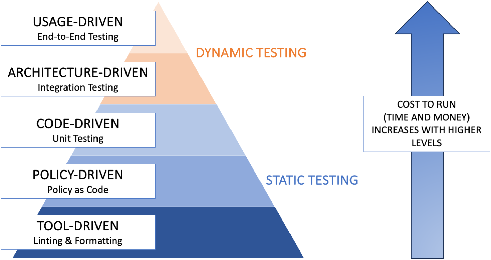
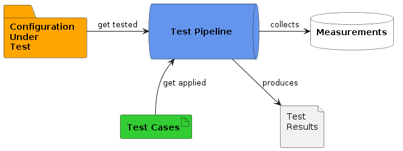
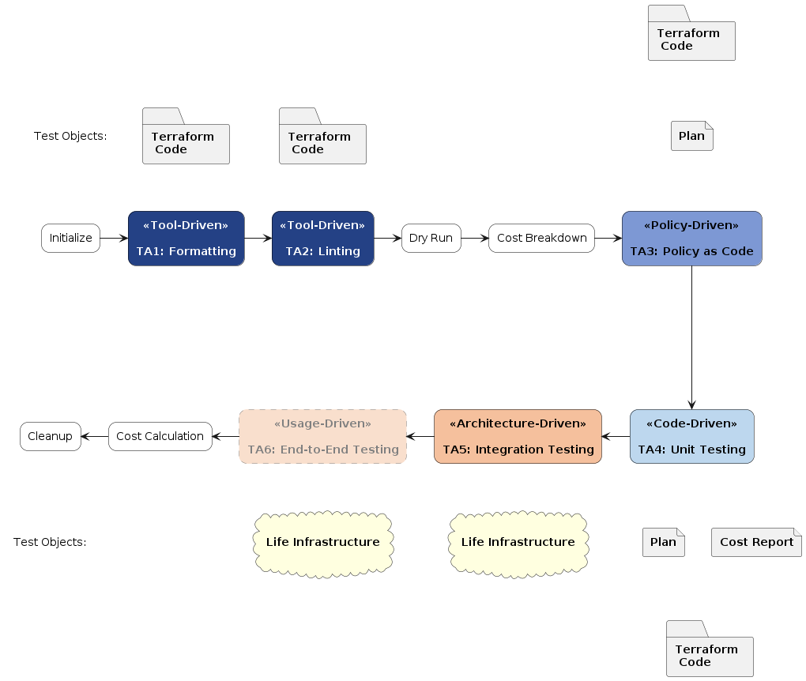

# Quantitative Cost Assessment of IaC Testing: POC

## Introduction

This repository introduces the Proof of Concept (PoC) for the [Master Thesis "Quantitative Cost Assessment of IaC Testing"](https://github.com/fex01/thesis-ws/blob/main/Thesis%20Quantitative%20Cost%20Assessment%20of%20Infrastructure%20as%20Code%20Testing.pdf). Centered around our proposed IaC Test Pyramid, this PoC is a practical application aimed at comprehensive and balanced test strategies. It evaluates the efficiency of various IaC test approaches and showcases a versatile Test Pipeline. Crucially, this POC validates our Test Suitability Matrix, demonstrating which test approaches effectively cover specific defect categories. Designed for practitioners, it offers a comprehensive, actionable framework for IaC testing, balancing cost, and effectiveness in real-world scenarios.

## Setup

For setting up and running this PoC, please refer to the separate repository [thesis-ws](https://github.com/fex01/thesis-ws). The *thesis-ws* repository serves as a supporting workspace and contains essential guides and tooling required for the setup and execution of the PoC.

The separation of these repositories is intended to facilitate streamlined testing. By isolating the executable code, the test pipeline can directly check out only the components necessary for execution, thereby simplifying the test process.

## Repository Structure

- `Jenkinsfile`: Implements the Test Pipeline as a Jenkins declarative pipeline.
- `*.tf` Files: Terraform configuration files constituting the Configuration Under Test (CUT).
- `pytest`, `terratest`, `tests`, `tfsec`: Directories containing test cases organized by the test tool (pytest, terratest, `terraform test`, and tfsec).
- `scripts`: Scripts for runtime measurement, cost calculation, and data collection.

## IaC Test Pyramid

The POC aligns with our proposed IaC Test Pyramid, covering different test level from diverse static test approaches to dynamic end-to-end testing, to promote comprehensive and balanced IaC test strategies.

  
*Figure IaC Test Pyramid: Adapted for IaC, our model emphasizes a strategic shift. A spectrum of static test approaches forms the base. Traditionally dynamic unit testing is now a static layer. The peak consists of dynamic tests, used selectively due to their higher costs.*

## Key Components

*Figure: The POC structure features the Test Pipeline (blue), applicable to any Terraform project, alongside an exemplary project's CUT (orange) and Test Cases (green). The pipeline executes the Test Cases against the CUT, producing Test Results (grey) and aggregating Measurements (white) across all runs, providing data to assess the efficacy of test approaches.*

### Test Pipeline

The Test Pipeline, implemented in Jenkins, automates and standardizes the execution of Test Cases, ensuring consistent and repeatable test processes. It captures essential metrics like runtime and cost estimations.

  
*Figure Test Pipeline: Incorporates a diverse array of exchangeable test tools, demonstrating its flexibility. The stages are color-coded for visual alignment with the IaC Test Pyramid, while static test objects are grey, dynamic infrastructure is yellow, and supporting utility stages are white.*

### CUT

A Terraform configuration deployed on AWS. It mirrors a typical real-world IaC environment, including VPCs, EKS clusters, and RDS instances. The CUT is used to demonstrate the practical application of the IaC Test Pyramid and the Test Suitability Matrix.

### Test Cases

In this PoC, the implemented test cases are organized according to the Test Approach (TA) and Defect Category (DC) they target. The objective is to validate the [Test Suitability Matrix](#test-suitability-matrix) proposed in our thesis by implementing test cases for each corresponding DC/TA match, thereby demonstrating its practical applicability.

#### Test Suitability Matrix

|                     | TA1 (Formatting) | TA2 (Linting) | TA3 (PaC) | TA4 (Unit) | TA5 (Integration) | TA6 (E2E) |
|---------------------|------------------|---------------|-----------|------------|-------------------|-----------|
| DC1 Conditional     |                  |               |           | 🟢 [tc1](./tests/tc1_dc1_ta4.tftest.hcl), [tc2](./tests/tc2_dc1_ta4.tftest.hcl)        | 🟡 [tc3](./tests/tc3_dc1_ta_5_no-predeployment.tftest.hcl), [tc4](./tests/tc4_dc1_ta5.tftest.hcl)               |           |
| DC2 Configuration   |                  |               |           | 🟢 [tc5](./tests/excluded/tc5_dc2_ta4.tftest.hcl), [tc6](./pytest/test_tc6_dc2_ta4.py)       | 🟡 [tc7](./tests/excluded/tc7_dc2_ta5.tftest.hcl)                |            |
| DC3 Dependency      |                  |               |           | 🔵 [tc8](./pytest/test_tc8_dc3_ta4.py)        | 🔵 [tc9](./tests/tc9_dc3_ta5.tftest.hcl) | 🔵         |
| DC4 Documentation   |                  |               |           | 🟡 [tc10](./pytest/test_tc10_dc4_ta4.py)        |                   |           |
| DC5 Idempotency     |                  |               |           |            | 🟢 [tc11](./terratest/tc11_dc5_ta5_test.go) | 🟡         |
| DC6 Security        |                  |               | 🔵 [tc12](./tfsec/tc12_dc6_ta3_tfchecks.yaml)       | 🟡 [tc13](./pytest/test_tc13_dc6_ta4.py)        | 🔵 [tc14](./terratest/tc14_dc6_ta5_test.go) | 🔵         |
| DC7 Service         |                  |               |           |            |                   | 🟢         |
| DC8 Syntax          | 🔵               | 🔵           |           |            |                   |           |

- 🟢 = **Full Suitability**: This indicates that the given test approach can comprehensively address the entire defect category. Every facet of the defect category can be effectively tested using this approach.
  - Example: Static Unit Testing (TA4) is well suited for verifying the results of each conditional logic expression within a Terraform configuration by analyzing the `terraform plan` output.
- 🔵 = **Partial Suitability**: While the test approach can address a significant portion of the defect category, there remain certain aspects that it cannot feasibly cover. However, when complemented by another test approach that also partly covers the defect category, full suitability might be achievable.
  - Formatting (TA1) and Linting (TA2) each tackle different facets of syntax defects. When combined, they work synergistically to address the full spectrum of syntax-related issues.
- 🟡 = **Minimal Suitability**: This denotes that the test approach can only touch upon a few basic elements of the defect category. It may require more effort to utilize this approach for the specific defect category and typically lacks built-in support for comprehensive testing. It's more of a workaround than a solution for the particular defect category.
  - Example: While Static Unit Testing (TA4) using pytest can technically leverage the full capabilities of the Python programming language to emulate policies of a PaC tool, PaC tools inherently come with built-in libraries of pre-defined policies and offer straightforward custom policy definition without the need for extensive programming expertise.

#### Specific Test Cases

Overlapping test cases exist across different test approaches for the purpose of comparative analysis. For instance, the test case validating that _passwords are flagged as sensitive_ is common between Policy as Code (TA3) and Static Unit Testing (TA4). Similarly, tests for _variable validation_ overlap between Static Unit Testing (TA4) and Dynamic Integration Testing (TA5).

##### Tool-Driven Testing (TA1, TA2)

For Formatting (TA1) and Linting (TA2), no specific test cases are needed as they are tool-driven, primarily focusing on Syntax (DC8). The tools used for these approaches are `terraform fmt` and `terraform validate`, respectively.

##### Policy as Code (TA3)

Policy as Code (TA3) addresses Security (DC6) with a custom policy to ensure that [passwords are flagged as sensitive](./tfsec/tc12_dc6_ta3_tfchecks.yaml). The tool used for this approach is `tfsec`.

##### Static Unit Testing (TA4)

Various defect categories were addressed - initially using terraform test and supplementing with pytest where required.

- Conditional Logic (DC1) is covered through:
  - [Variable validation](./tests/tc1_dc1_ta4.tftest.hcl) (`terraform test`)
  - [For loops](./tests/tc2_dc1_ta4.tftest.hcl) (`terraform test`)
- Configuration Data (DC2) is verified with:
  - [blast radius check](./tests/excluded/tc5_dc2_ta4.tftest.hcl) (`terraform test`)
  - [Validate configuration expectation](./pytest/test_tc6_dc2_ta4.py) (pytest)
- Dependencies (DC3):
  - [Module is locally available](./pytest/test_tc8_dc3_ta4.py) (pytest)
- Documentation (DC4):
  - [Readme exists and has an Acknowledgment section](./pytest/test_tc10_dc4_ta4.py) (pytest)
- Security (DC6): [Passwords are flagged as sensitive](./pytest/test_tc13_dc6_ta4.py) (pytest)

##### Dynamic Integration Testing (TA5)

- Test cases for Integration Testing (TA5) primarily employ `terraform test` and are supplemented with Terratest where necessary. They are designed to cover:

- Conditional Logic (DC1):
  - [Variable validation](./tests/tc3_dc1_ta_5_no-predeployment.tftest.hcl) (`terraform test`)
  - [For loops](./tests/tc4_dc1_ta5.tftest.hcl) (`terraform test`)
- Configuration Data (DC2):
  - [Blast radius check](./tests/excluded/tc7_dc2_ta5.tftest.hcl) (`terraform test`)
- Dependencies (DC3):
  - [Module resources got deployed](./tests/tc9_dc3_ta5.tftest.hcl) (`terraform test`)
- Idempotency (DC5):
  - [Terratest Idempotency Test](./terratest/tc11_dc5_ta5_test.go) (Terratest)
- Security (DC6):
  - [Private IP address for RDS](./terratest/tc14_dc6_ta5_test.go) (Terratest)

##### End-2-End Testing (TA6)

No TCs have been designed or implemented for E2E Testing (TA6). This category is of scope for this thesis.
However, it's worth noting that the main difference between Integration Testing (TA5) and End-2-End Testing (TA6) lies less in the tools employed and more in the perspective of the tests.
Unlike other test approaches that concentrate on technical requirements, E2E testing is designed to verify the product's usability from a customer's standpoint.
Achieving this would require the development of user stories for our Configuration Under Test (CUT).

To illustrate, consider the following examples for different Defect Categories (DCs) in E2E Testing:

- DC3 (Dependency): A user story could involve different components interacting together. In this scenario, the focus would not be on the individual components themselves but on the overall user experience. Nevertheless, if the components are poorly integrated, the test case would fail.
- DC5 (Idempotency): An E2E test case might aim to ensure that customer usability is not affected during system rollouts, taking steps to prevent data corruption or loss.
- DC6 (Security): Security in the context of E2E tests could mean ensuring that customers cannot access restricted internal portals, offering a different dimension to security tests than other test approaches.

## License

[MIT License](https://choosealicense.com/licenses/mit/)

## Acknowledgment

The [Configuration under Test](#cut) was originally developed by Mattia Caracciolo for his thesis titled [Policy as Code, how to automate cloud compliance verification with open-source tools](https://webthesis.biblio.polito.it/26908/).
Mattia did not publish his code but graciously permitted us to adapt and publish the code for the purpose of this thesis.
We extend our sincere thanks to Mattia for his contribution.

---

For any questions or concerns, please raise an issue in the repository or contact the [author](mailto:iac-testing-repo@miske.email) directly.

Thank you for taking an interest in this research.
